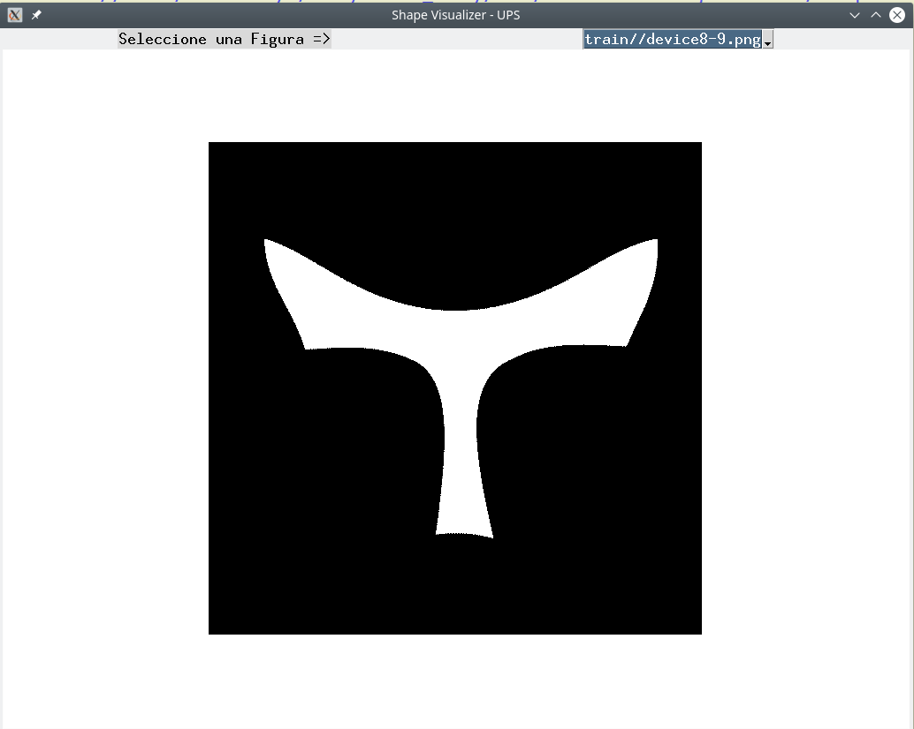

# shape-recognition-ANN
A simple example to implement a shape recognizer using a **MLPClassifier** from [Scikit-Learn Python library](https://scikit-learn.org/).

Currently this project is used by my undergraduate students to implement a simple Multilayer Perceptron to classify shapes (using the [HuMoments](https://en.wikipedia.org/wiki/Image_moment) extracted for each image). After finishing this midterm project, I'll add the rest of the code.

Likewise, the conde includes a simple script develped in Python to visualize each figure (shape): ShapeVisualizer.py

.

The HuMoments are computed using the C++ files (HuMomentsExtractor.cpp, HuMomentsExtractor.hpp, and Principal.cpp files) and stored in the file HuMoments.csv.

# Prerrequisites
The prerrequisites depend on what codes do you need to run:

* If you want to run the code to extract HuMoments, it is necessary to have installed:
  * [OpenCV 4.0](https://opencv.org/)
* If you want to run the Python code (ShapeVisualizer.py and Utilities) you will need:
  * Python 3.7
* To run the classifier (available soon) it would be required:
  * [Scikit-Learn 0.21.3](https://scikit-learn.org/)
